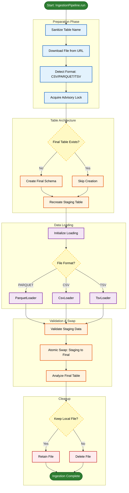

<div align="center">

# NY Taxi Data Ingestion
### ETL with Docker Compose & PostgreSQL


<p>
Downloads NYC Taxi trip data and loads it into PostgreSQL.
</p>

</div>

---

## What this project does

- Downloads a file from a URL (`.parquet`, `.csv`, `.csv.gz`, `.tsv`)
- Creates/maintains a destination table in Postgres
- Loads data into a staging table
- Validates the staging table
- Renames staging to the final table name
---
## Pipeline diagram

<div align="center">


</div>
---

## Project structure

```text
.
├── Makefile
├── README.md
├── docker-compose.yml
├── main.py
├── pyproject.toml
├── uv.lock
├── docker_ingestion_pipeline/
│   ├── Dockerfile
│   ├── config.py
│   ├── core/
│   ├── db/
│   ├── ports/
│   └── utils/
├── data/         # downloaded files (mounted to /app/data)
├── logs/         # app logs (mounted to /app/logs)
├── ny_data/      # Postgres data directory (bind mount)
├── sql/
├── notebooks/    # planned
└── tests/        # planned

````

---

## Requirements

**Recommended**

* Docker
* Docker Compose

**Optional (run without Docker)**

* Python >= 3.13
* `uv`
* PostgreSQL

---

## Quickstart (Docker Compose)

### 1) Create `.env` in the repo root

`docker-compose.yml` loads env vars for `app` via `env_file: .env`.

Example:

```ini
DB_USER=postgres
DB_PASSWORD=postgres
DB_NAME=ny_taxi

DB_HOST=localhost
DB_PORT=5432

DATA_URL=<DATA_URL>

# optional
KEEP_LOCAL=true
PARQUET_BATCH_SIZE=100000
LOG_LEVEL=INFO
```

### 2) Run

```bash
docker-compose up --build
```

This compose file defines:

* Postgres service name: `db` (container_name: `postgres_db`)
* App service name: `app` (container_name: `ingestion_app`)
* Network: `dtc-net`
* Postgres data stored in `./ny_data` (bind mount)

Stop:

```bash
docker-compose down
```

Remove containers + reset Postgres data:

```bash
docker-compose down -v
```

> Note: The compose file declares a named volume `pgdata`, but the `db` service uses `./ny_data:/var/lib/postgresql/data`.

---

## Command cheat sheet

| Action              | Command                                                      |
| ------------------- | ------------------------------------------------------------ |
| Start               | `docker-compose up --build`                                  |
| Stop                | `docker-compose down`                                        |
| App logs            | `docker-compose logs -f app`                                 |
| DB logs             | `docker-compose logs -f db`                                  |
| Open psql           | `docker exec -it postgres_db psql -U <DB_USER> -d <DB_NAME>` |
| Reset Postgres data | `docker-compose down -v`                                     |

---

## CLI usage (main.py)

`main.py` reads defaults from environment variables (including those provided by Docker Compose),
and you can override any value via flags.

### Flags reference (matches `main.py`)

| Flag                   | Env default used by code | Type    | Default if env is missing    | Description                                           |
| ---------------------- | ------------------------ | ------- | ---------------------------- | ----------------------------------------------------- |
| `--user`               | `DB_USER`                | string  | `postgres`                   | Postgres username                                     |
| `--password`           | `DB_PASSWORD`            | string  | `postgres`                   | Postgres password                                     |
| `--host`               | `DB_HOST`                | string  | `localhost`                  | Postgres host                                         |
| `--port`               | `DB_PORT`                | string  | `5432`                       | Postgres port                                         |
| `--db`                 | `DB_NAME`                | string  | `ny_taxi`                    | Postgres database name                                |
| `--url`                | `DATA_URL`               | string  | *(none)*                     | Data file URL (`.parquet`, `.csv`, `.csv.gz`, `.tsv`) |
| `--table_name`         | *(none)*                 | string  | *(auto from URL if omitted)* | Destination table name                                |
| `--keep_local`         | `KEEP_LOCAL`             | boolean | `true`                       | Keep the downloaded file after ingestion              |
| `--parquet_batch_size` | `PARQUET_BATCH_SIZE`     | int     | `100000`                     | Rows per Parquet batch when streaming into Postgres   |

### Table name inference (when `--table_name` is omitted)

`main.py` infers the table name from the URL filename by:

* removing `.parquet` / `.csv` / `.csv.gz`
* replacing `-` with `_`

Example:

* `green_tripdata_2019-09.parquet` → `green_tripdata_2019_09`

> Note: The current inference function removes `.csv(.gz)` and `.parquet`.
> If you use a `.tsv` URL, pass `--table_name` explicitly.

### Examples

#### 1) Show help

```bash
python main.py --help
```

#### 2) Run using `.env` / environment defaults

```bash
python main.py
```

> Requires `DATA_URL` to be set (or pass `--url`).

#### 3) Run with an explicit URL (table name auto-inferred for CSV/Parquet)

```bash
python main.py --url <DATA_URL>
```

#### 4) Run with explicit URL + explicit table name (recommended for TSV)

```bash
python main.py --url <DATA_URL> --table_name <TABLE_NAME>
```

#### 5) Change Parquet batch size

```bash
python main.py --url <DATA_URL> --parquet_batch_size 50000
```

#### 6) Delete the downloaded file after ingestion

```bash
python main.py --url <DATA_URL> --keep_local false
```

#### 7) Override Postgres connection settings (useful for local runs)

```bash
python main.py \
  --host localhost \
  --port 5432 \
  --user <DB_USER> \
  --password <DB_PASSWORD> \
  --db <DB_NAME> \
  --url <DATA_URL>
```

---

## Run the app with arguments (Docker Compose)

The image entrypoint is `python main.py`, so extra args are passed directly:

```bash
docker-compose run --rm app --url <DATA_URL>
```

With a table name:

```bash
docker-compose run --rm app --url <DATA_URL> --table_name <TABLE_NAME>
```

---

## What the pipeline does (IngestionPipeline.run)

**Names**

* Staging table: `<table_name>__staging`
* Lock key: `ingest:<table_name>`

**Steps**

1. Download the file and detect its type.
2. Acquire an advisory lock for the destination table.
3. If the final table does not exist: create it from the file schema.
4. Recreate the staging table to match the final table schema.
5. Load into staging:

   * Parquet → streamed in batches (`PARQUET_BATCH_SIZE`)
   * CSV/CSV.GZ → Postgres `COPY`
   * TSV → loaded using the TSV loader (tab-delimited)
6. Validate the staging table.
7. Rename staging to the final table name.
8. Run `ANALYZE` on the final table.
9. On failure: drop the staging table (best effort) and re-raise.
10. If `keep_local` is `false`: delete the downloaded file (best effort).

---

## Validation rules (PostgresStagingValidator)

The validator:

* Fails if staging row count is `0`
* Tries to find a datetime column using these candidates (first match wins):

  * `lpep_pickup_datetime`
  * `tpep_pickup_datetime`
  * `pickup_datetime`
* If a datetime column exists, it records:

  * `min_dt`, `max_dt`, `null_dt`
* If the final table name contains `YYYY_MM` (e.g. `green_tripdata_2019_09`), it checks whether
  `min_dt` and `max_dt` are inside that month.

  * Out-of-range results produce a warning (not a hard error)

---

## Verify the result

Open psql:

```bash
docker exec -it postgres_db psql -U <DB_USER> -d <DB_NAME>
```

Row count:

```sql
SELECT COUNT(*) FROM public.<TABLE_NAME>;
```

Columns:

```sql
SELECT column_name
FROM information_schema.columns
WHERE table_schema='public' AND table_name='<TABLE_NAME>'
ORDER BY ordinal_position;
```

---

## Run locally (DB still from Docker)

1. Start only Postgres:

```bash
docker-compose up -d db
```

2. Install deps:

```bash
uv sync --frozen
```

3. Run (set DB env vars, and pass `--url` if needed):

```bash
export DB_HOST=localhost
export DB_PORT=5432
export DB_USER=<DB_USER>
export DB_PASSWORD=<DB_PASSWORD>
export DB_NAME=<DB_NAME>

python main.py --url <DATA_URL> --table_name <TABLE_NAME>
```

---

## Logging and folders (config.py)

* Logs are written to:

  * stdout (level from `LOG_LEVEL`, default `INFO`)
  * `./logs/app.log` (DEBUG level, rotated at 10MB, kept for 7 days)
* Data directory default:

  * `DATA_DIR` if set
  * otherwise `./data`

---

## Notes about `.env` loading (matches current code)

There are two related `.env` behaviors in this project:

1) **Docker Compose `.env` for variable substitution (host-side)**  
   This `docker-compose.yml` uses `${DB_USER}`, `${DB_PASSWORD}`, `${DB_NAME}`, and `${DB_PORT}`.  
   Docker Compose reads the `.env` file in the same directory as the compose file to substitute those values when it parses the file.

2) **`app.env_file: .env` injects environment variables (container-side)**  
   The `app` service has:

   ```yaml
   env_file:
     - .env
   environment:
     - DB_HOST=db

This means:

* The `.env` file is used to set environment variables inside the `app` container.
* `DB_HOST` is explicitly overridden to `db` inside the container.
* `env_file` loads key/value pairs into the container environment, but it does not copy or mount the `.env` file into the container filesystem.

`main.py` also calls `load_dotenv()` using:

```python
ENV_PATH = Path(__file__).resolve().parent / ".env"
load_dotenv(dotenv_path=ENV_PATH)
```

* **Local run**: `ENV_PATH` points to `./.env` (repo root), so `load_dotenv()` reads the file.
* **Container run**: `ENV_PATH` points to `/app/.env`. This file is not created by `env_file`, so it may not exist.
  The script still works because Docker Compose already injects the variables, and `os.getenv(...)` reads them.

>**Note**: `load_dotenv()` does not override existing environment variables by default, so values injected by Docker Compose remain in effect.

---

<div align="center">
<em>DTC DE 2026 — 01-docker-terraform</em>
</div>