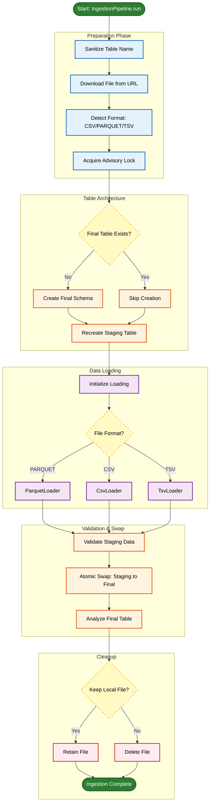

<div align="center">

# NY Taxi Data Ingestion
### ETL pipeline with Docker Compose + PostgreSQL


<p>
Downloads NYC Taxi trip data and loads it into PostgreSQL using a staging table and atomic swap.
</p>

</div>

---

## Overview

- Downloads a file from a URL (`.parquet`, `.csv`, `.csv.gz`, `.tsv`, `.tsv.gz`)
- Creates or reuses a destination table in Postgres
- Loads into a staging table, validates, then swaps into the final table
- Logs to console and `./logs/app.log` with optional tqdm progress bars

---

## Pipeline diagram

<div align="center">


</div>

---

## Quickstart (Docker Compose)

### 1) Create `.env` in the repo root

```ini
DB_USER=postgres
DB_PASSWORD=postgres
DB_NAME=ny_taxi

DB_HOST=localhost
DB_PORT=5432

DATA_URL=<DATA_URL>

# optional
KEEP_LOCAL=true
PARQUET_BATCH_SIZE=100000
LOG_LEVEL=INFO
ENABLE_PROGRESS=true
```
---

## Service Management

| **Action**                            | **Command**                                                                                   | **Description**                                                                 |
| ------------------------------------- | --------------------------------------------------------------------------------------------- | ------------------------------------------------------------------------------- |
| **Start Postgres Service**            | `docker-compose up -d --build db`                                                             | Start only the Postgres service in detached mode and build if necessary.        |
| **Start App Service**                 | `docker-compose up -d --build app`                                                            | Start the app service (idle by default) in detached mode and build if necessary.|
| **Run Data Ingestion**                | `docker-compose run --rm app python main.py ingest --url <DATA_URL>`                          | Run the ingestion process. Replace `<DATA_URL>` with the actual URL.            |
| **Run Ingestion with Table Name**     | `docker-compose run --rm app python main.py ingest --url <DATA_URL> --table-name <TABLE_NAME>`| Override destination table name (optional for all formats).                      |
| **Stop Services**                     | `docker-compose down`                                                                         | Stop and remove containers, networks, and volumes created by Compose.           |
| **Stop and Remove All Volumes**       | `docker-compose down -v`                                                                      | Stop and remove containers, networks, and volumes (incl. persistent volumes).   |

---

## CLI Usage

> Note: CLI commands can be run locally (`python main.py ...`) or via Docker Compose (`docker-compose run --rm app python main.py ...`).

| **Action**                                 | **Command**                                                         | **Description**                                                                                          |
| ------------------------------------------ | ------------------------------------------------------------------- | -------------------------------------------------------------------------------------------------------- |
| **Show All CLI Commands**                  | `python main.py --help`                                             | Show the top-level help for the project, including all available commands.                               |
| **Show Help for `ingest` Subcommand**      | `python main.py ingest --help`                                      | Show help specific to the `ingest` subcommand for ingestion-related options.                             |
| **Run Ingestion**                          | `python main.py ingest --url <DATA_URL>`                            | Run the ingestion process by providing the data URL to ingest. Replace `<DATA_URL>` with the actual URL. |
| **Run Ingestion with Specific Table Name** | `python main.py ingest --url <DATA_URL> --table-name <TABLE_NAME>`  | Override the destination table name. Replace `<TABLE_NAME>` with the actual table name.                  |
| **Run Ingestion with Schema Option**       | `python main.py --schema analytics ingest --url <DATA_URL>`         | Run ingestion using a specific schema (`analytics`) along with the data URL.                              |
| **Run Ingestion with Custom Batch Size**   | `python main.py ingest --url <DATA_URL> --parquet-batch-size 50000` | Run ingestion with a specified batch size for Parquet files (e.g., 50000 rows per batch).               |
| **Run Ingestion with No Local File Keep**  | `python main.py ingest --url <DATA_URL> --no-keep-local`            | Run ingestion and do not keep the downloaded file locally after ingestion.                               |

---

## Configuration

### Environment variables

| Variable | Default     | Description                          |
| --- |-------------|--------------------------------------|
| `DB_USER` | `postgres`  | Postgres username                    |
| `DB_PASSWORD` | `postgres`  | Postgres password                    |
| `DB_NAME` | `ny_taxi`   | Postgres database name               |
| `DB_SCHEMA` | `public`    | Schema for tables                    |
| `DB_HOST` | `localhost` | Postgres host                        |
| `DB_PORT` | `5432`      | Postgres port                        |
| `DATA_URL` | *(none)*    | Source file URL                      |
| `DATA_DIR` | `./data`    | Where downloads are stored           |
| `KEEP_LOCAL` | `true`      | Keep downloaded file after ingestion |
| `PARQUET_BATCH_SIZE` | `100000`    | Rows per Parquet batch               |
| `LOG_LEVEL` | `INFO`      | Console log level                    |
| `ENABLE_PROGRESS` | `true`      | Enable tqdm progress bars            |

### CLI flags

Global options come before `ingest`:

```bash
python main.py --schema analytics ingest --url <DATA_URL>
```

| Flag | Env | Default | Description |
| --- | --- | --- | --- |
| `--user` | `DB_USER` | `postgres` | Postgres username |
| `--password` | `DB_PASSWORD` | `postgres` | Postgres password |
| `--host` | `DB_HOST` | `localhost` | Postgres host |
| `--port` | `DB_PORT` | `5432` | Postgres port |
| `--db` | `DB_NAME` | `ny_taxi` | Postgres database name |
| `--schema` | `DB_SCHEMA` | `public` | Postgres schema |
| `--url` | `DATA_URL` | *(none)* | Data file URL |
| `--table-name` / `--table_name` | *(none)* | *(auto for CSV/Parquet)* | Destination table name |
| `--keep-local` / `--no-keep-local` | `KEEP_LOCAL` | `true` | Keep downloaded file |
| `--parquet-batch-size` / `--parquet_batch_size` | `PARQUET_BATCH_SIZE` | `100000` | Rows per Parquet batch |

---

## Table name inference

If `--table-name` is omitted, the name is inferred from the URL filename:

- `.csv`, `.csv.gz`, `.tsv`, `.tsv.gz`, and `.parquet` are stripped
- `-` is replaced with `_`

Example:

- `green_tripdata_2019-09.parquet` -> `green_tripdata_2019_09`

Notes:

- Table names must be valid identifiers: letters, numbers, and underscores only.
- Use `--table-name` to override the inferred table name.

---

## Ingestion flow (IngestionPipeline.run)

1. Download file and detect format.
2. Acquire an advisory lock for `ingest:<table_name>`.
3. Create the final table if it does not exist (schema inferred from input).
4. Recreate the staging table from the final table schema.
5. Load data into staging (Parquet streaming or CSV/TSV COPY).
6. Validate staging table.
7. Swap staging into the final table atomically.
8. Run `ANALYZE` on the final table.
9. On failure, attempt to drop the staging table and re-raise.
10. Remove the local file if `keep_local` is `false`.

---

## Validation rules

The validator:

- Fails if staging row count is `0`
- Tries to find a datetime column (first match wins):
  - `lpep_pickup_datetime`
  - `tpep_pickup_datetime`
  - `pickup_datetime`
- Records `min_dt`, `max_dt`, and `null_dt` for the datetime column when present
- If the table name contains `YYYY_MM` (example: `green_tripdata_2019_09`), it checks spillover outside that month
  - Spillover currently logs a warning (not a hard error)

---

## Logging and progress

- Console logs use `LOG_LEVEL` (default `INFO`).
- File logs are written to `./logs/app.log` (DEBUG level, rotated at 10MB, kept for 7 days).
- Progress bars are enabled when `ENABLE_PROGRESS=true` and `tqdm` is installed.
- Downloads default to `./data` or `DATA_DIR` if set.

---

## Verify the result

```bash
docker exec -it postgres_db psql -U <DB_USER> -d <DB_NAME>
```

```sql
SELECT COUNT(*) FROM public.<TABLE_NAME>;
```

```sql
SELECT column_name
FROM information_schema.columns
WHERE table_schema = 'public' AND table_name = '<TABLE_NAME>'
ORDER BY ordinal_position;
```

---

## Notes and troubleshooting

- The app container uses `tail -f /dev/null` by default, so it stays idle until you run a command.
- If a file with the same name already exists in `data/`, the downloader skips re-downloading. Delete the file to force a fresh download.
- The atomic (whole or nothing) download pattern ensures downloads are not left half-written (download to a temp file, then rename on success).
- In Docker Compose, `.env` is injected into the container environment via `env_file`. The file itself is not mounted into the container.

---

## Project structure

```text
.
├── Makefile
├── README.md
├── docker-compose.yml
├── main.py
├── pyproject.toml
├── uv.lock
├── docker_ingestion_pipeline/
│   ├── Dockerfile
│   ├── config.py
│   ├── core/
│   ├── db/
│   ├── ports/
│   └── utils/
├── data/         # downloaded files (mounted to /app/data)
├── logs/         # app logs (mounted to /app/logs)
├── ny_data/      # Postgres data directory (bind mount)
├── sql/
├── notebooks/
└── tests/
```

---

<div align="center">
<em>DTC DE 2026 - 01-docker-terraform</em>
</div>
